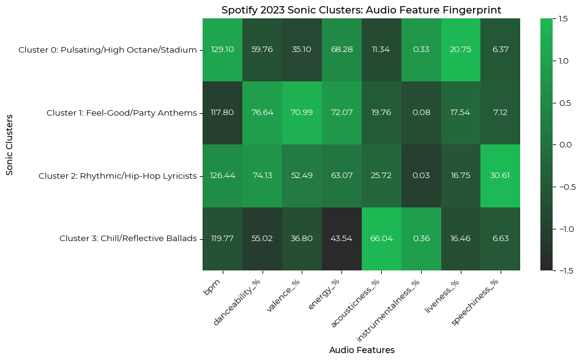
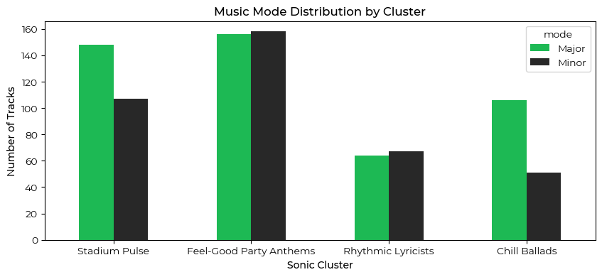

## Spotify 2023 Top Tracks: Sonic Clusters & Efficiency Analysis

> ### Can you predict a global "mega hit" using only audio fingerprint and anticipate a track's success pre-release?

### Summary
This project explores the relationship between a song's **sonic DNA** and its **market performance**. By analyzing the [Spotify 2023 Top Tracks data](https://www.kaggle.com/datasets/nelgiriyewithana/top-spotify-songs-2023), I moved beyond simple stream volume to uncovering the types of music that build traction/emotional connection (and hence user retention) vs those that rely on editorial assistance.

### Key Findings & Strategic Recommendations
- **Predictive Gap**: Audio features alone could not predict / differentiate a "mega hit" from a "standard hit" ($\text{F1 score}$ = 0.20), but platform distribution / playlist saturation explained 87% of success (large stream volumes).
- While **playlisting is the primary driver of reach and audience engagement**, Cluster 3 (Melodic/Ballad) tracks demonstrated the highest **Stream Efficiency** (streams-to-playlist ratio), suggesting a unique listener loyalty (continuous re-engagement) that goes beyond traditional marketing (e.g. being in as many playlists as possible).
- **Business Strategy**:
    - **Retention over Reach**: Prioritizing Ballad-Style/Acoustic tracks (Cluster 3) in personalized engines like *Discover* can help prevent subscription churn as these songs build the emotional attachment between a user/listener and their saved/playlisted songs.
    - **Operational Efficiency**: Identifying Cluster 3 profiles early allows the editorial team to boost streams / achieve stream targets with fewer playlist adds/saturation, freeing up the "digital real estate" for emerging artists, thus diversifying the ecosystem.

### Tech Stack
- **Analysis**: Python (*Pandas*, *NumPy*, *Scikit-Learn*)
- **Dimensionality Reduction**: Principal Component Analysis (PCA)
- **Clustering**: K-Means Algorithm with Elbow/Scree Plots
- **Statistical Inference**: $\chi^2$-test for independence (*SciPy*)
- **Classification Modeling**: Decision Tree Classifier
- **Visualization**: *Matplotlib*, *Seaborn*

### Methodology
**Phase 0: Data Preprocessing & Exploratory Data Analysis (EDA)**  
The dataset was cleaned and filtered to ensure the analysis was accurate and representative. I also looked at correlations between audio features to check for multi-collinearity before applying K-Means.
- **Feature Selection**: From the 24 available columns, I kept the columns representing intrinsic audio characteristics (BPM, energy, valence, etc.) and market metrics (streams, playlists).
- **Data Type Correction**: Handled object-to-numeric conversion of `streams` column.

 

**Phase 1: Identifying "Sonic Clusters"**  
I observed that using raw music data, that could have long tails / extreme values e.g. in `instrumentalness_%`, can lead to overfitting of K-Means. To address this, I used a 3-stage approach with dimensionality reduction, feature engineering & optimal-k validation.
- **Dimensionality Reduction (PCA)**: Used PCA with `full` SVD solver to capture 85% of variance across 6 principal components, thus reducing noise.
- **Feature Engineering**: Applied `log1p` transformation to `instrumentalness_%` and clipped scaled features to $[-3, 3]$ to prevent extreme values from dramatically impacting the clusters.
- **Validation**: Used the `KneeLocator` (elbow method) to determine an optimal number of clusters ($K=4$), resulting in more balanced and interpretable groups.
<table>
    <th><tr><td>Cluster</td><td>Persona</td><td>Primary Signal</td></tr></th>
    <tr><td>0</td><td>Pulsating / High-Octane</td><td>High BPM, High Liveness</td></tr>
    <tr><td>1</td><td>Feel-Good Anthems / Party-Starters</td><td>High Valence, High Energy, High Danceability</td></tr>
    <tr><td>2</td><td>Rhythmic Lyricists</td><td>High Speechiness</td></tr>
    <tr><td>3</td><td>Chill Melodies / Reflective Ballads</td><td>High Acoustic, Low Energy</td></tr>
</table>

 

**Phase 2: Statistical Inference**  
To see if clusters were musically meaningful, I performed a $\chi^2$-test between clusters and music mode (major/minor keys).

**Null Hypothesis $H_0$**: There is no relationship between sonic cluster and music mode.

**Significant Finding**: With a **p-value of 0.0009**, the relationship between music style and mode is statistically significant and I dropped the null hypothesis, concluding that there is a relationship between the two.

The **Chill & Reflective Cluster 3** leans heavily into major keys (~2:1 ratio), suggesting that the successful ballads of 2023 aren't necessarily "sad/melancholic", but rather use the harmonic stability of major scales to create sentimental, resonant & relatable tracks.

I also used **euclidean distance to centroids** to compute and identify the top 3 tracks that were most representative of each cluster, ranging from the high-energy reggaeton of *Playa Del Inglés* from Cluster 1 to the core fan-favorite tracks like One Direction's *Night Changes* (Cluster 3).

 

**Phase 3: Success Modeling → Streams-to-Playlist Efficiency**    
**Initial Modeling:**
- In the final phase, I tested whether a song's "sonic fingerprint" could predict its status as a "mega hit" (defined as top 10% of top streams).
- Using an "audio features only" model, the decision tree struggled, with an $\text{F1 score}$ of only 0.20, suggesting that no specific musical style ("sonic fingerprint") is guaranteed to top the charts.
- However, by adding in `in_spotify_playlists` to the algorithm, the $\text{F1 score}$ jumped to 0.70, with the additional feature accounting for 87% of predictive power. This suggests that platform distribution is the main "gatekeeper" of stream volume.

**Discovery:**
- Since post-release track performance (on the Spotify platform) was largely dependent on presence in playlists, I pivoted to a different metric: **Stream Efficiency** (modeled by number of streams per playlist addition).
- Tracks in Cluster 3, despite having lower playlist saturation than tracks in Clusters 0 and 1, achieved the highest average efficiency (~234k streams per playlist), suggesting that these tracks generate "high-quality" streams and more active rather than passive listeners. These are the users who return to the platform consistently to listen to their favorite songs.
